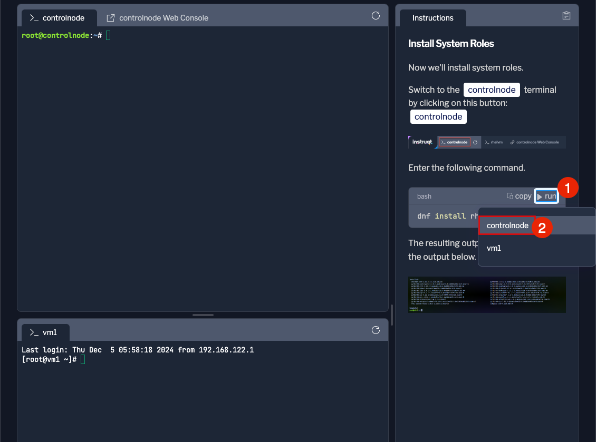
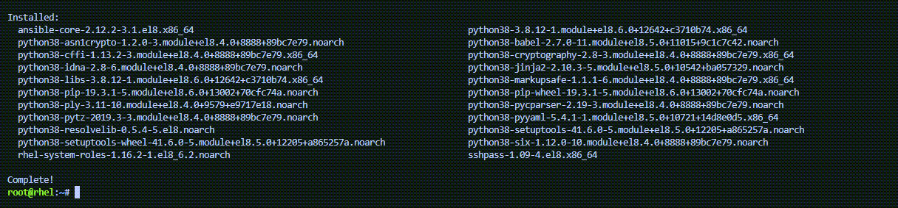

Now we’ll install system roles.

Switch to the link:tab-0[button label="`controlnode`"] terminal by
clicking on this button: link:tab-0[button label="`controlnode`"]

.rhel tab

Enter the following command.

[source,bash,run]
----
dnf install rhel-system-roles -y
----

____
{empty}[!NOTE] You can click on the `+run+` button and select the
terminal where you wish to run the command.

____

The resulting output will look similar to the output below.

.srinstalled

