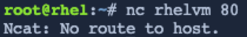
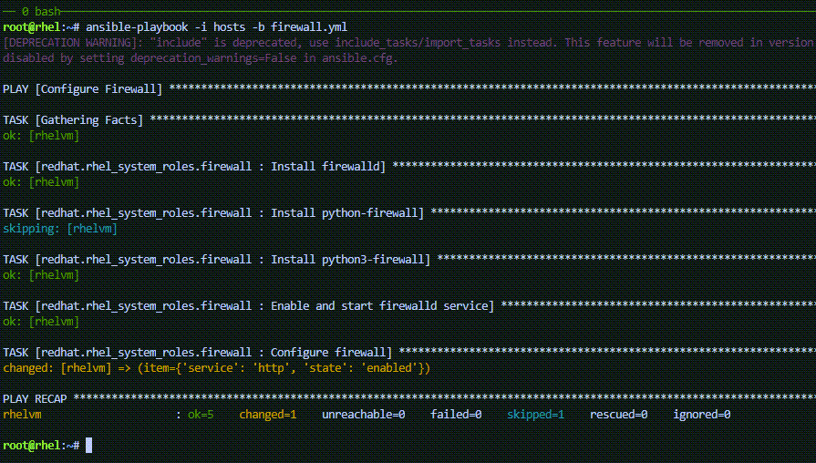
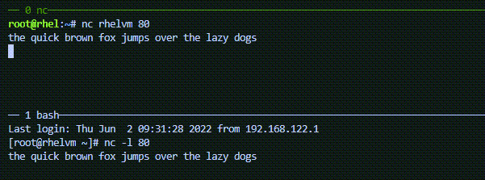
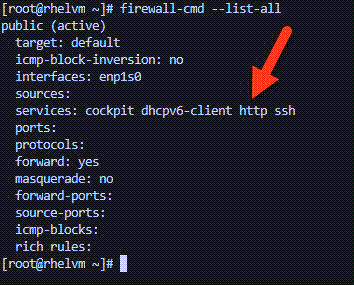

In this challenge, we will enable access to the http port 80 on `+rhel1+`.

First, we’ll prove to ourselves that port 80 is blocked by the firewall
running on `+rhel1+`.

Switch to the link:tab-1[button label="`rhel1`"] terminal by clicking on
this button: link:tab-1[button label="`rhel1`"].

Run the following in link:tab-1[button label="`rhel1`"].

[source,bash,run]
----
firewall-cmd --list-all
----

.fwcmdno80
image::fwcmdno80.png[fwcmdno80]

The output above shows that port 80 is not open.

In the `+rhel1+` terminal, run `+nc -l 80+`. This command runs the utility
`+netcat+` and tells it to listen for incoming traffic on port 80.

[source,bash,run]
----
nc -l 80
----

.nclistening

`+netcat+` is now listening on port 80 on `+rhel1+`.

____
[!WARNING] Do not exit out of `+nc+` in this terminal!
____

Switch back to the link:tab-0[button label="`controlnode`"] terminal.

Enter the command `+nc rhel1 80+`. This tells `+netcat+` to connect to
port 80 on `+rhel1+`.

[source,bash,run]
----
nc rhel1 80
----

.noroute

`+netcat+` cannot connect to `+rhel1+` on port 80.

Let’s use RHEL systems roles to open up port 80 on `+rhel1+`.

First, Ansible requires a host file pointing at the `+rhel1+` host. The
host file looks like this.

Copy and paste the following into the link:tab-0[button
label="`controlnode`"] terminal.

[source,bash,run]
----
tee -a /root/hosts << EOF
all:
  hosts:
    rhel1:
  vars:
    firewall:
      - service: http
        state: enabled
EOF
----

Next, we’ll create a simple Ansible playbook that tells ansible to apply
the RHEL Firewall system role.

Copy paste and run the following in the CLI.

[source,bash,run]
----
tee -a /root/firewall.yml <<EOF
- name: Configure Firewall
  hosts: all
  roles:
    - redhat.rhel_system_roles.firewall
EOF
----

Now we’ll apply the system role to `+rhel1+` by running the following
command on link:tab-0[button label="`controlnode`"] .

[source,bash,run]
----
ansible-playbook -i hosts -b firewall.yml
----

.applysystemrole

Run `+nc rhel1 80+` in the link:tab-0[button label="`controlnode`"]
terminal again.

[source,bash,run]
----
nc rhel1 80
----

We’ll type something into the terminal and hit enter. You should see it
printed out in the link:tab-1[button label="`rhel1`"] terminal.

.ncresult80

Exit out of `+nc+` in the link:tab-0[button label="`controlnode`"]
terminal by typing `+ctrl-c+`. This will cause `+nc+` to exit in
link:tab-1[button label="`rhel1`"].

Finally, we’ll use `+firewall-cmd+` to list the open ports on
link:tab-1[button label="`rhel1`"]. Switch to the link:tab-1[button
label="`rhel1`"] terminal and run the following command.

[source,bash,run]
----
firewall-cmd --list-all
----

.fwcmdlistall80

