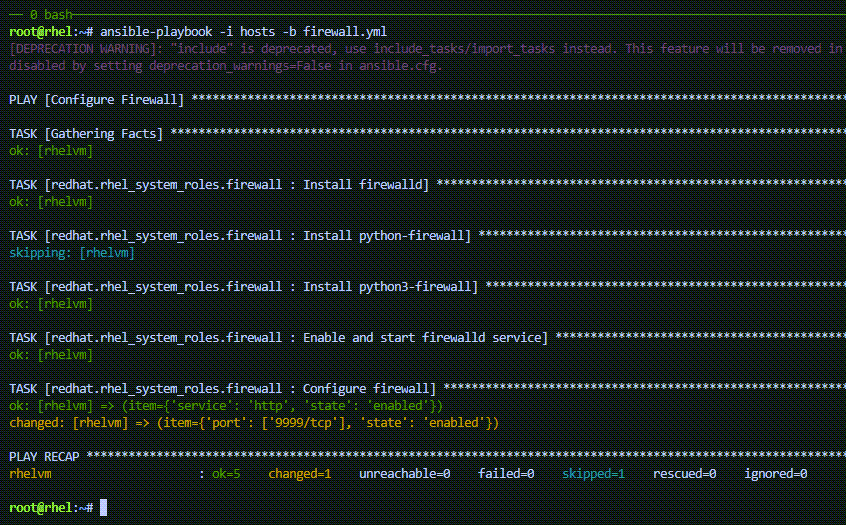
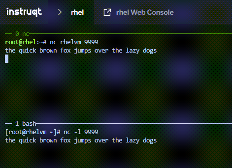

In this challenge we’ll open port 9999 on `+rhel1+`.

In the link:tab-0[button label="`controlnode`"] terminal, add the lines
`+- port: ['9999/tcp']+` and `+state: enabled+` to the `+hosts+` file.

The following command will add those lines for you.

[source,bash,run]
----
tee -a /root/hosts << EOF
      - port: ['9999/tcp']
        state: enabled
EOF
----

Now run the playbook in the link:tab-0[button label="`controlnode`"]
terminal.

[source,bash,run]
----
ansible-playbook -i hosts -b firewall.yml
----

.applyportopen

In the link:tab-1[button label="`rhel1`"] terminal, run `+nc+`, listening
on port 9999.

[source,bash,run]
----
nc -l 9999
----

In the link:tab-0[button label="`controlnode`"] terminal, run `+nc+` and
then type some stuff.

[source,bash,run]
----
nc rhel1 9999
----

.ncport9999

In the image above the phrase was typed:
`+the quick brown fox jumps over the lazy dogs+` followed by the
`+enter+` key.

In the link:tab-0[button label="`controlnode`"] terminal, type
`+ctrl-c+` to exit `+nc+`.
