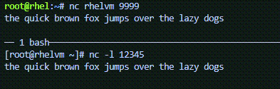

In this challenge we’ll forward incoming tcp requests to vm1 on port
9999 to 12345.

In the link:tab-0[button label="`controlnode`"] terminal, add the lines
`+- forward_port: '9999/tcp;12345;'+` and `+state: enabled+`.

The following command will add those lines for you.

[source,bash,run]
----
tee -a /root/hosts << EOF
      - forward_port: '9999/tcp;12345;'
        state: enabled
EOF
----

Now run the playbook in the link:tab-0[button label="`controlnode`"]
terminal.

[source,bash,run]
----
ansible-playbook -i hosts -b firewall.yml
----

In the link:tab-1[button label="`vm1`"] terminal, run `+nc+`, listening
on port 12345.

[source,bash,run]
----
nc -l 12345
----

In the link:tab-0[button label="`controlnode`"] terminal, run `+nc+` and
then type some stuff.

[source,bash,run]
----
nc vm1 9999
----

.ncport9999

Type `+ctrl-c+` to exit `+nc+`.
