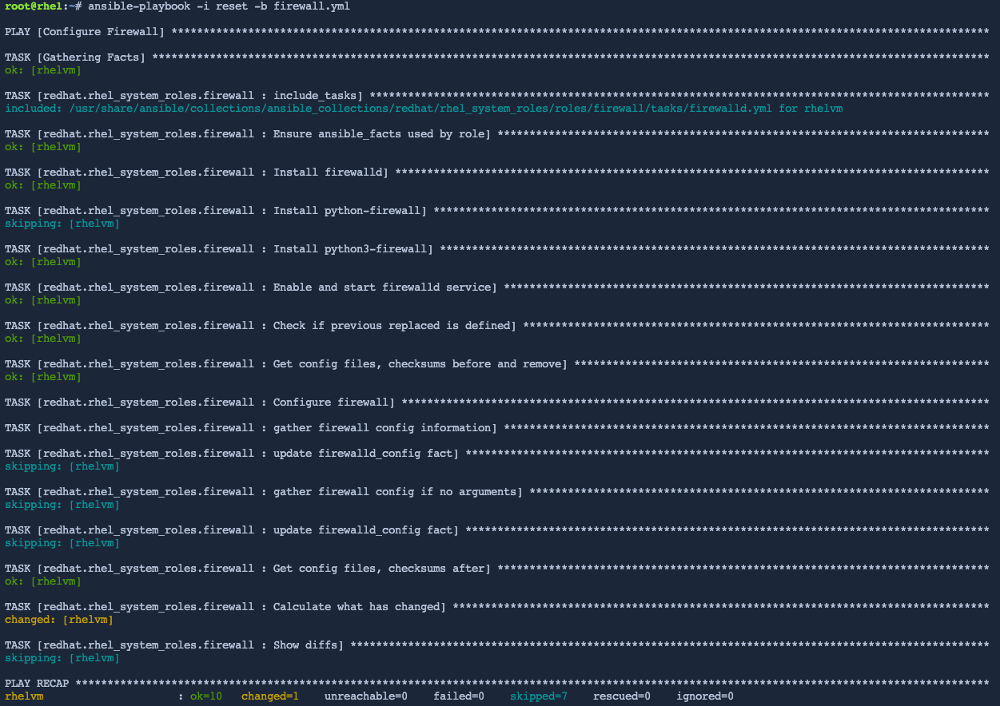

The firewall system role can reset all settings to the default
configuration found immediately after Red Hat Enterprise Linux is
installed.

We’ll reset the firewall configuration in the `+vm1+` host.

First, in the link:tab-1[button label="`vm1`"] terminal, list the
current rules.

[source,bash,run]
----
firewall-cmd --list-all
----

In the link:tab-0[button label="`controlnode`"] terminal, we’ll create a
new host file called `+reset+`.

[source,bash,run]
----
tee -a /root/reset << EOF
all:
  hosts:
    vm1:
  vars:
    firewall:
      - previous: replaced
EOF
----

From the link:tab-0[button label="`controlnode`"] terminal, run the
playbook to reset the firewall rules on the `+vm1+` host.

[source,bash,run]
----
ansible-playbook -i reset -b firewall.yml
----

.reset output

When the playbook as stopped running, switch to the link:tab-1[button
label="`vm1`"] terminal and check that the firewall rules have been
reset.

[source,bash,run]
----
firewall-cmd --list-all
----

If you want to apply the rules we created in the previous steps of this
lab, simply run `+ansible-playbook -i hosts -b firewall.yml+` again.
